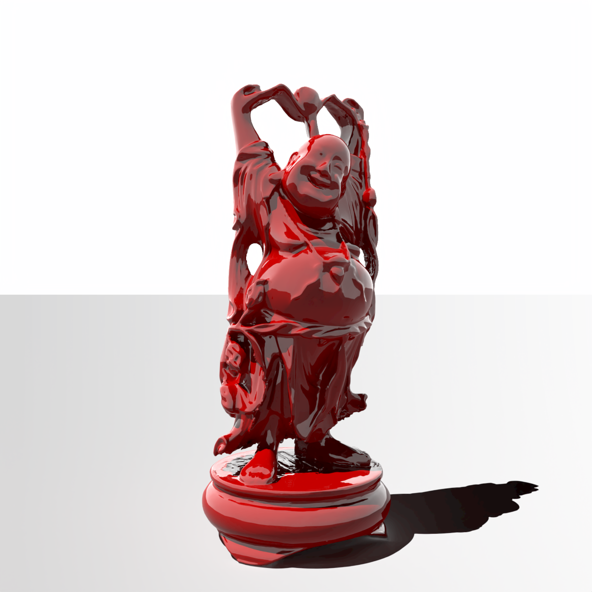

# rust-raytracer

Basic ray-tracer in Rust, following the [PBRT Book](https://pbr-book.org/3ed-2018/contents).

Features done:

- Objects (planes, triangles)
- Meshes
- Obj file loading
- Lights (point, area, distant)
- Materials (matte, half of plastic)
- Microfacet distribution
- Multithreading
- Multiple Importance Sampling
- Denoising using OpenImage Denoise
- Basic scene format

Todo:

- Transmittance (BTDF)
- File output
- Textures / Env map
- Bump mapping
- Gltf loading maybe
- Other things

## Build and run

You need a copy of Intel® Open Image Denoise (IOID). Grab a package from their 
[download section](https://www.openimagedenoise.org/downloads.html). Unpack this 
somewhere. We refer to this below as the OIDN location.

Export the OIDN location to your environment so the build can find the headers & libraries. For example:
```
export OIDN_DIR=$HOME/Downloads/oidn-1.3.0.x86_64.linux/
```

And then run the renderer:
```
cargo run --release ./scene/buddha
```


## Usage

You have to provide a scene folder to the renderer. The scene folder should contain a `scene.yaml`
file and a `render_settings.yaml` file

```
rust-raytracer 

USAGE:
    rust-raytracer [SCENE_FOLDER]

ARGS:
    <SCENE_FOLDER>    

OPTIONS:
    -h, --help    Print help information
```

During rendering, press and hold D for debug layers (probably nothing will show)
and N for normals.

## Examples

Using the methods described in the PBRT book:


Dragon model with a plastic microfacet material (white pixels are a bug). This render also
shows area lights and DoF.



Happy Buddha model with a specular reflection material, scene lit using one distant light.

Old whitted raytracer:

Fresnel reflections:


Obj model loading and triangle intersection:

