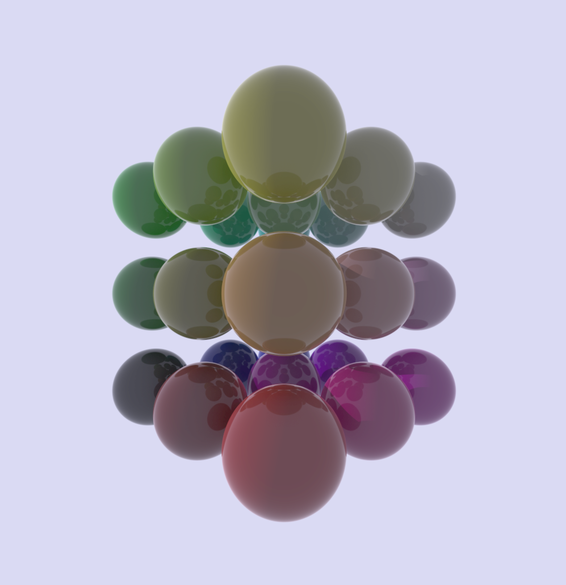
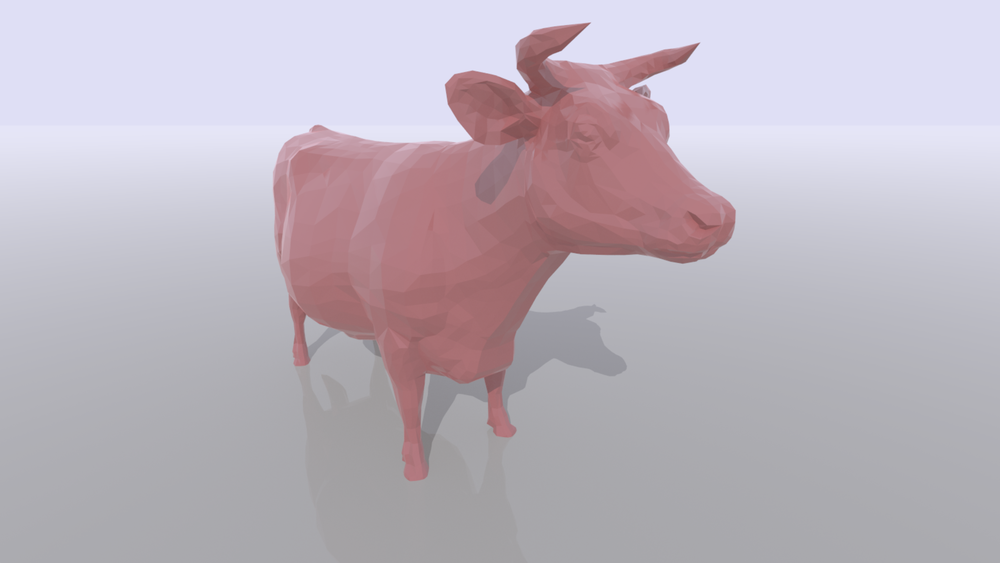

# rust-raytracer

Basic ray-tracer in Rust.

Features done:

- Spheres
- Planes
- Triangles
- Rectangles
- Reflection
- Refraction
- Fresnel material
- Multithreading
- Adaptive ray depth
- Obj loading

Todo:

- BxDF
- File output
- Static dispatch for materials
- Better scenes
- Textures
- Vertex normal interpolation


## Example

Fresnel reflections:


Obj model loading and triangle intersection:


## Build and run

You need a copy of Intel® Open Image Denoise (IOID). Grab a package from their 
[download section](https://www.openimagedenoise.org/downloads.html). Unpack this 
somewhere. We refer to this below as the OIDN location.

Export the OIDN location for the build to find the headers & libraries. For example:

```
export OIDN_DIR=$HOME/Downloads/oidn-1.3.0.x86_64.linux/
```


```
cargo run --release ./scene/cornell/scene.yaml ./scene/cornell/render_settings.yaml
```

During rendering, press and hold D for denoise and N for normals.

## Usage

```
rust-raytracer 

USAGE:
    rust-raytracer [ARGS]

ARGS:
    <SCENE_FILE>       
    <SETTINGS_FILE>    

OPTIONS:
    -h, --help    Print help information
```